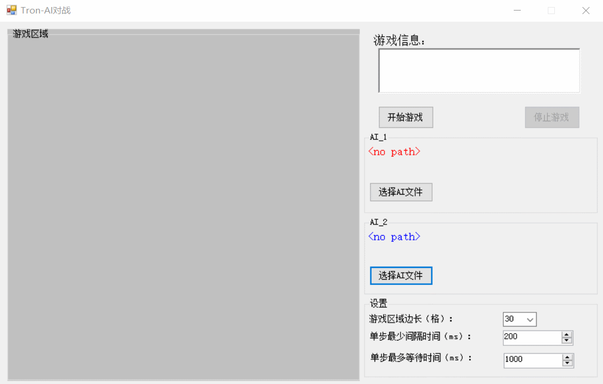

# AI-Tron 简介

> AI-Tron 是一个支持双AI对战的 C# Tron 游戏（即 Code Fight / Code Battle）。
>
> 玩家需要编写 AI 程序，并通过Controller程序调用 AI 进行 **AI-AI** 对战。

## 一、游戏规则

在 Tron 游戏中，两个玩家将各自编写一个 AI，利用该 AI 控制一个Head结点在地图上移动，移动过的轨迹将**不会消除**。当 Head 结点撞墙或者撞上任何一个玩家的**移动轨迹**或**Head结点**（包括自己）则游戏失败，坚持到最后的玩家即为胜者。

## 二、开始

- **编译**

  使用 VS 编译文件夹 [AI-Tron-Controller-project](https://github.com/Kiprey/AI-Tron/tree/master/AI-Tron-Controller-project) 内的 C# 项目以生成 Controller 程序。

  使用 C++ 语言编写文件夹 [TronAICode-cpp](https://github.com/Kiprey/AI-Tron/tree/master/TronAICode-cpp) 内的 [AI.cpp](https://github.com/Kiprey/AI-Tron/blob/master/TronAICode-cpp/AI.cpp) 文件，以实现其中 `AIGetDirect` 函数。

  > **注意其他 C++ 文件不允许修改。**
>
  > **不允许使用与标准输入输出流相关的函数，包括但不限于 cout, cin, cerr**。如有需求，请使用 `void TronAPI::printDbgMsg(string)` 函数
  
  之后编译该 C++ 项目以生成 AI 程序。
  
- **运行**

  启动 Controller 程序，选择对应的 AI 程序，设置好相应的设置后，点击开始游戏。 Controller 程序将自动调用所选的 AI 程序以获取下一步的路径。

- **启动示例**

  

  每次对局时，Controller 进程将会保存当前对局的对局信息（包括但不限于棋盘长宽、棋盘上的结点信息等），有助于玩家调试自己的 AI 程序。上一句的对局信息将会被删除，请及时保存。

- **编写 AI**

  C++ 项目中支持以下 API 接口，方便玩家编写 AI

  ```cpp
  namespace TronAPI {
  	// 坐标类
  	struct Point {
  		int x, y;
  		Point(int _x = -1, int _y = -1) : x(_x), y(_y) {}
  	};
  	// 地图的结点类
  	enum MapNodeType { AI1_BODY, AI2_BODY, AI1_HEAD, AI2_HEAD, NONE };
  	// DirectType 分别标识上下左右四个方向，以及上一次的方向
  	// 由于执行程序时没有上一次方向的信息，因此 DirectType::None 可以看作听天由命 XD
  	enum DirectType { Up, Down, Left, Right, None };
  	enum AIType { AI1, AI2, UNINIT };
  	using MapRowType = vector<MapNodeType>;
  	using MapType = vector<MapRowType>;
  
  	// 获取特定类型的结点
  	Point getTargetTypePoint(bool typeCheck(MapNodeType));
  
  	inline int getMapLength();
  	inline int getMapWidth();
  	inline const MapType getMap();
  
  	// 判断传入的 Point 是否越界 / 撞墙
  	bool nodeIsOutOfBound(Point point);
  
  	// 判断当前结点是否为当前 AI 的结点
  	bool nodeIsSelfHead(MapNodeType node);
  	bool nodeIsSelfHead(Point point);
  
  	bool nodeIsSelfBody(MapNodeType node);
  	bool nodeIsSelfBody(Point point);
  
  	// 判断当前结点是否为对手 AI 的结点
  	bool nodeIsEnemeHead(MapNodeType node);
  	bool nodeIsEnemeHead(Point point);
  
  	bool nodeIsEnemeBody(MapNodeType node);
  	bool nodeIsEnemeBody(Point point);
  
  	// 判断当前结点是否没有被占据
  	bool nodeIsEmpty(MapNodeType node);
  	bool nodeIsEmpty(Point point);
  
  	// 将错误信息输出至 standard error 流上，并强制退出当前程序
  	// 注意执行该函数传入的信息，将会被显示在 远程的RichTextBox中
  	void reportErrorAndAbort(string msg);
  	// 将信息返回至远程程序，但不abort
  	void reportInfo(string msg);
  	// 用户调试用的输出，这类输出将被远程程序截获，但不会被处理
  	void printDbgMsg(string msg);
  	// 从远程程序中获取地图信息以及当前身份
  	void getMapAndAIRoleFromRemote();
  	// 设置当前AI的下一个方向
  	void setNextDirection(DirectType direct);
  	// 获取某个坐标向特定方向移动后的坐标
  	Point getTheUpPoint(Point point);
  	Point getTheDownPoint(Point point);
  	Point getTheLeftPoint(Point point);
  	Point getTheRightPoint(Point point);
  	// 获取头节点地址
  	Point getSelfHeadPoint();
  	Point getEnemyHeadPoint();
  };
  ```

## 三、技术细节


## 四、可以改进的地方

> 以下这些点实现起来并不困难，只是需要点时间。
>
> 主要是我想偷个懒，所以，**欢迎 Pull Request！**
>
> 如果觉得有点难想合作改进的也可以联系我！

- **对 Python 语言编写的 AI 程序提供支持**

  现阶段只实现了 C++ 编写的 AI 程序的支持，而对于编写 AI 来说，Python 是必不可少的。

  支持 Python 语言所需的操作较为简单：

  - 在Controller程序处，修改Form1.cs文件中的`OpenFileDialog.Filter`为`"Windows可执行文件|*.exe|Python脚本文件|*.py"`
  - 在Controller程序内部，执行用户 AI 程序时，判断当前获取的 AI 文件是否为 Python 脚本：如果不是则直接启动该可执行文件，否则先去环境变量中获取 Python 解释器的路径，然后设置执行参数，并执行该 Python 解释器。
  - 实现 Python 语言的各类 API 函数，就像 C++ 项目一样

- **改进进程间通信方式**

  为了便于实现，现阶段Controller进程与AI进程的交互是通过标准输入输出进行（思路参考OnlineJudge）。但这里存在一个问题，只有当AI程序关闭后，Controller进程才能拿到AI进程的输出信息，也就是说 AI进程只能返回一次数据至Controller进程；同时，由于进程间交互占用了标准输入输出流，因此用户调试时就不能随意打log。综上，这里需要进行进一步的改进。

  进程间通信，最常用的方式有：共享内存、网络Socket通信以及Windows API `SendMessage` 函数等等。为了实现简便，我们可以使用 **SendMessage**  API 来进行进程间通信。

  改进后的 AI 程序可以与 Controller 进程进行更加高级的信息交互，例如输出作者信息等等。同时，由于不需要在游戏中每走一步就 Kill 掉 AI 进程，因此我们可以只启动一个 AI 进程，然后 AI 进程内部循环获取地图、计算策略、返回下一步方向。

  同时，这也为实现 **支持Python 语言的 AI 程序**提供了一个非常好的土壤，因为对于大部分机器学习/深度学习来说，是需要跑数据集的，因此不可能跑完程序集后，输出一个结果就立马关闭进程，然后下次执行时再重新跑。这是相当相当浪费时间的。

- **实现远程对战**（参考 [SSHTron](https://github.com/zachlatta/sshtron)）

  即Controller进程放在服务器上跑，玩家只需执行 AI 程序与服务器进行网络连接、信息交互即可。由于本地对战的源码已经编写完成，因此我们可以在该源码的基础之上，非常方便的编写出服务器端的Server Controller。

  不过与本地的Controller不同的是，放在服务器上执行的 Server Controller 需要考虑到多个玩家连接的情况，因此需要先使用一个队列将所有连接进行储存。如果当前队列中存在两个及以上个连接，则循环取出两个连接 => 重置游戏数据 => 对这两个连接开始游戏。需要注意的是每个对局都必须开一个线程，在该线程上声明新的Controller类实例以及Game类实例。

  最后，对于多线程程序来说，务必要避开死锁和条件竞争等较为烦人的问题。 

  对于本地的 AI 程序。只需再添加一个**显示地图和信息输出的 UI** 即可。

  远程对战的 Controller 和 AI 程序可以全部用 C++ 程序编写，这样便于跨平台玩耍。

## 五、其他说明

- 如果满意自己所编写的 AI 算法，想将它分享出去，欢迎提交 Pull Request 到该仓库的 `AI-Code-Repository`文件夹中。

- 如果有想实现上面那些改进点的小想法，也欢迎提交 Pull Request。

- 如果有任何问题，欢迎[联系我](mailto: Kiprey@qq.com)